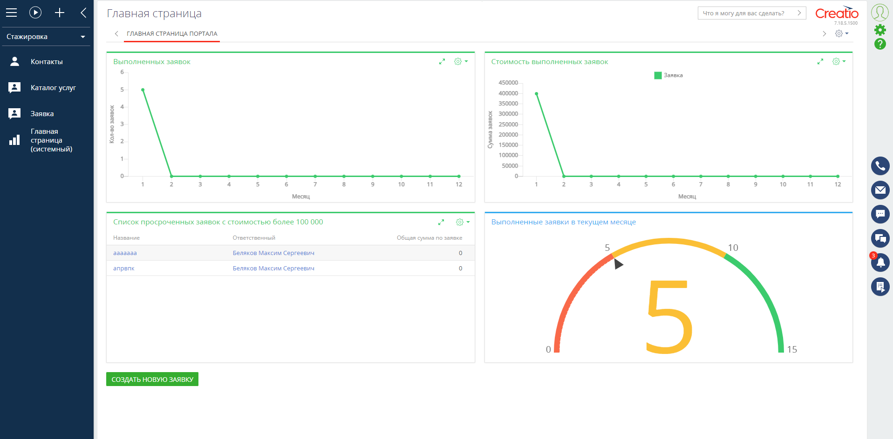

# Здесь хранятся мои шаблоны для быстрого создания фичей

### 1. [Создание кнопки в разделе аналитики](./sources/widgetButtonCreation.js)

Наследуется от Terrasoft.BaseModel, поэтому для работы модуля нужно объявить:
```javascript
    Ext: null,
    sandbox: null,
    Terrasoft: null,
    viewModel: null,
    view: null,
```

viewModel является контекстом выполнения и view в него биндится

Скриншот кнопки:




### 2. Вызов бизнес процесса через js

```javascript
    func: function() {
        ProcessModuleUtilities.executeProcess({
          sysProcessName: "BusinessProcessName",
          parameters: {
            Param: this.get("ParamField"),
          }
        });
      }
```

### 3. Указать версию ecmascript

Полифилов нету, поэтому можно игнорить предупреждения

Нужно вставить в начало файла:
```javascript
/*jshint esversion: 6 */
```
